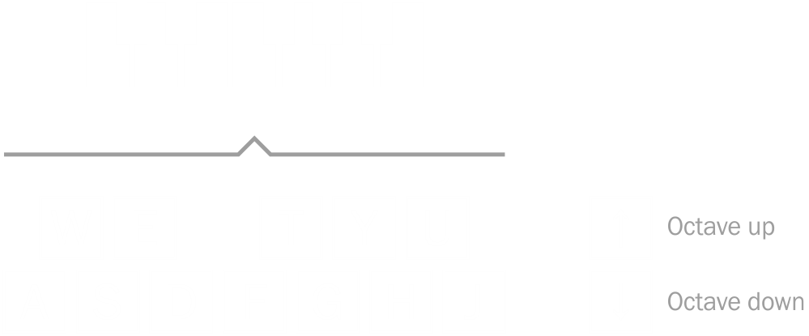

# Input device

In DryWetMIDI an input MIDI device is represented by [IInputDevice](xref:Melanchall.DryWetMidi.Devices.IInputDevice) interface. It allows to receive events from a MIDI device. To understand what an input MIDI device is in DryWetMIDI, please read [Overview](Overview.md) article.

The library provides built-in implementation of `IInputDevice`: [InputDevice](xref:Melanchall.DryWetMidi.Devices.InputDevice) class. To get an instance of `InputDevice` you can use either [GetByName](xref:Melanchall.DryWetMidi.Devices.InputDevice.GetByName(System.String)) or [GetById](xref:Melanchall.DryWetMidi.Devices.InputDevice.GetById(System.Int32)) static methods. ID of a MIDI device is a number from `0` to _devices count minus one_. To get count of input MIDI devices presented in the system there is the [GetDevicesCount](xref:Melanchall.DryWetMidi.Devices.InputDevice.GetDevicesCount) method. You can get all input MIDI devices with [GetAll](xref:Melanchall.DryWetMidi.Devices.InputDevice.GetAll) method.

> [!IMPORTANT]
> You can use `InputDevice` built-in implementation of `IInputDevice` on Windows only. Of course you can create your own implementation of `IInputDevice` as described in [Custom input device](#custom-input-device) section below.

After an instance of `InputDevice` is obtained, call [StartEventsListening](xref:Melanchall.DryWetMidi.Devices.IInputDevice.StartEventsListening) to start listening incoming MIDI events going from an input MIDI device. If you don't need to listen for events anymore, call [StopEventsListening](xref:Melanchall.DryWetMidi.Devices.IInputDevice.StopEventsListening). Also this method will be called automatically on [Dispose](xref:Melanchall.DryWetMidi.Devices.MidiDevice.Dispose). To check whether `InputDevice` is currently listening for events or not use [IsListeningForEvents](xref:Melanchall.DryWetMidi.Devices.IInputDevice.IsListeningForEvents) property.

If an input device is listening for events, it will fire [EventReceived](xref:Melanchall.DryWetMidi.Devices.IInputDevice.EventReceived) event for each incoming MIDI event. Received MIDI event will be passed to event's handler.

Small example (console app) that shows receiving MIDI data:

```csharp
using System;
using Melanchall.DryWetMidi.Devices;

namespace InputDeviceExample
{
    class Program
    {
        private static IInputDevice _inputDevice;

        static void Main(string[] args)
        {
            _inputDevice = InputDevice.GetByName("Some MIDI device");
            _inputDevice.EventReceived += OnEventReceived;
            _inputDevice.StartEventsListening();

            Console.WriteLine("Input device is listening for events. Press any key to exit...");
            Console.ReadKey();

            (_inputDevice as IDisposable)?.Dispose();
        }

        private static void OnEventReceived(object sender, MidiEventReceivedEventArgs e)
        {
            var midiDevice = (MidiDevice)sender;
            Console.WriteLine($"Event received from '{midiDevice.Name}' at {DateTime.Now}: {e.Event}");
        }
    }
}
```

> [!IMPORTANT]
> You should always take care about disposing an `InputDevice`, so use it inside `using` block or call `Dispose` manually. Without it all resources taken by the device will live until GC collect them via finalizer of the `InputDevice`. It means that sometimes you will not be able to use different instances of the same device across multiple applications or different pieces of a program.

`InputDevice` has [MidiTimeCodeReceived](xref:Melanchall.DryWetMidi.Devices.InputDevice.MidiTimeCodeReceived) event which, by default, will be fired only when **all** MIDI Time Code components (separate [MidiTimeCodeEvent](xref:Melanchall.DryWetMidi.Core.MidiTimeCodeEvent) events) are received forming _hours:minutes:seconds:frames_ timestamp. You can turn this behavior off by setting [RaiseMidiTimeCodeReceived](xref:Melanchall.DryWetMidi.Devices.InputDevice.RaiseMidiTimeCodeReceived) to `false`.

If an invalid [channel](xref:Melanchall.DryWetMidi.Core.ChannelEvent), [system common](xref:Melanchall.DryWetMidi.Core.SystemCommonEvent) or [system real-time](xref:Melanchall.DryWetMidi.Core.SystemRealTimeEvent) event received, [InvalidShortEventReceived](xref:Melanchall.DryWetMidi.Devices.InputDevice.InvalidShortEventReceived) event will be fired holding the bytes that form the invalid event. If invalid system exclusive event received, [InvalidSysExEventReceived](xref:Melanchall.DryWetMidi.Devices.InputDevice.InvalidSysExEventReceived) event will be fired holding sysex data.

## Custom input device

You can create your own input device implementation and use it in your app. For example, let's create device that will listen for specific keyboard keys and report corresponding note via [EventReceived](xref:Melanchall.DryWetMidi.Devices.IInputDevice.EventReceived) event. Also we will control current octave with _up arrow_ and _down arrow_ increasing or decreasing octave number correspondingly. Following image shows the scheme of our device:



Now we implement it:

```csharp
public sealed class KeyboardInputDevice : IInputDevice
{
    public event EventHandler<MidiEventReceivedEventArgs> EventReceived;

    private static readonly Dictionary<ConsoleKey, NoteName> NotesNames = new Dictionary<ConsoleKey, NoteName>
    {
        [ConsoleKey.A] = NoteName.C,
        [ConsoleKey.W] = NoteName.CSharp,
        [ConsoleKey.S] = NoteName.D,
        [ConsoleKey.E] = NoteName.DSharp,
        [ConsoleKey.D] = NoteName.E,
        [ConsoleKey.F] = NoteName.F,
        [ConsoleKey.T] = NoteName.FSharp,
        [ConsoleKey.G] = NoteName.G,
        [ConsoleKey.Y] = NoteName.GSharp,
        [ConsoleKey.H] = NoteName.A,
        [ConsoleKey.U] = NoteName.ASharp,
        [ConsoleKey.J] = NoteName.B
    };

    private readonly Thread _thread;
            
    private int _octaveNumber = 4;
    private SevenBitNumber? _currentNoteNumber;

    public KeyboardInputDevice()
    {
        _thread = new Thread(ListenEvents);
    }

    public bool IsListeningForEvents { get; private set; }

    public void StartEventsListening()
    {
        _thread.Start();
        IsListeningForEvents = true;
    }

    public void StopEventsListening()
    {
        if (_currentNoteNumber != null)
            EventReceived?.Invoke(this, new MidiEventReceivedEventArgs(
                new NoteOffEvent(_currentNoteNumber.Value, SevenBitNumber.MinValue)));

        IsListeningForEvents = false;
    }

    private void ListenEvents()
    {
        while (IsListeningForEvents)
        {
            var key = Console.ReadKey(true);
            if (!NotesNames.TryGetValue(key.Key, out var noteName))
            {
                switch (key.Key)
                {
                    case ConsoleKey.UpArrow:
                        _octaveNumber++;
                        Console.WriteLine($"Octave is {_octaveNumber} now");
                        break;
                    case ConsoleKey.DownArrow:
                        _octaveNumber--;
                        Console.WriteLine($"Octave is {_octaveNumber} now");
                        break;
                    case ConsoleKey.Escape:
                        StopEventsListening();
                        Console.WriteLine("Listening stopped.");
                        break;
                }

                continue;
            }

            var noteNumber = CalculateNoteNumber(noteName, _octaveNumber);
            if (!IsNoteNumberValid(noteNumber))
                continue;

            if (_currentNoteNumber != null)
                EventReceived?.Invoke(this, new MidiEventReceivedEventArgs(
                    new NoteOffEvent(_currentNoteNumber.Value, SevenBitNumber.MinValue)));

            EventReceived?.Invoke(this, new MidiEventReceivedEventArgs(
                new NoteOnEvent((SevenBitNumber)noteNumber, SevenBitNumber.MaxValue)));

            _currentNoteNumber = (SevenBitNumber)noteNumber;
        }
    }

    private static bool IsNoteNumberValid(int noteNumber)
    {
        return noteNumber >= SevenBitNumber.MinValue && noteNumber <= SevenBitNumber.MaxValue;
    }

    private static int CalculateNoteNumber(NoteName noteName, int octave)
    {
        return (octave + 1) * Octave.OctaveSize + (int)noteName;
    }
}
```

We can then use it for [Recording](xref:Melanchall.DryWetMidi.Devices.Recording) or [redirecting](Devices-connector.md) received notes to real output device to make them sound:

```csharp
var outputDevice = OutputDevice.GetByName("Microsoft GS Wavetable Synth");
var devicesConnector = keyboardInputDevice.Connect(outputDevice);
```